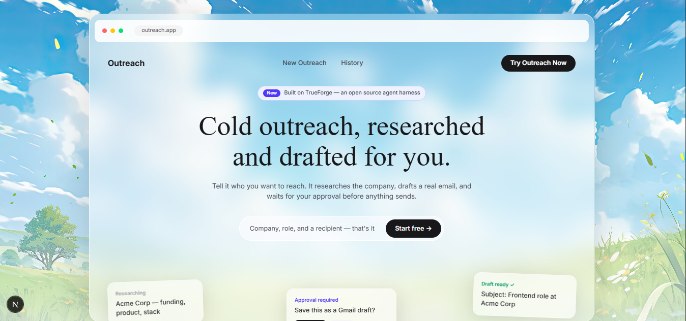
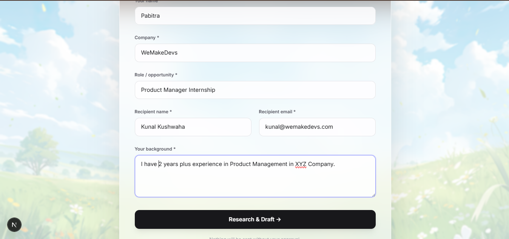
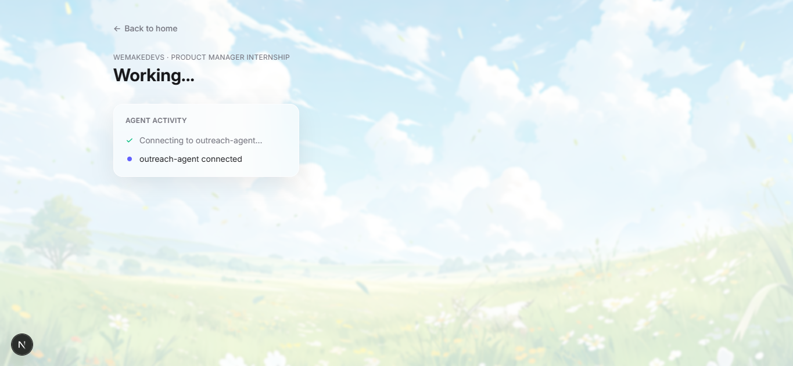
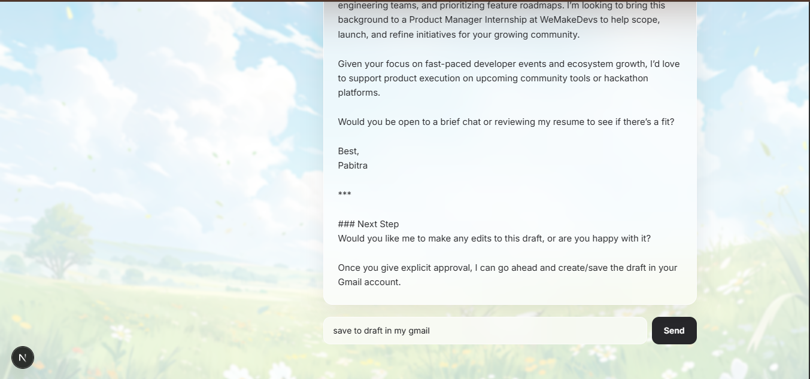
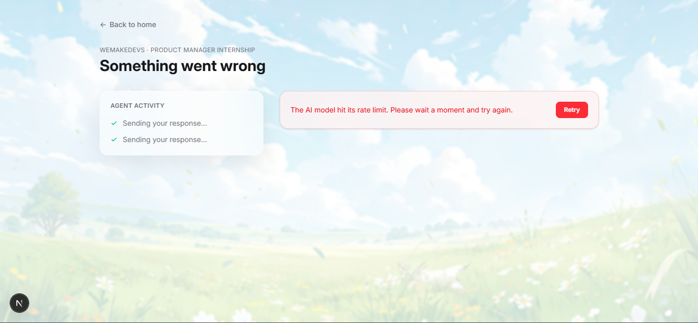
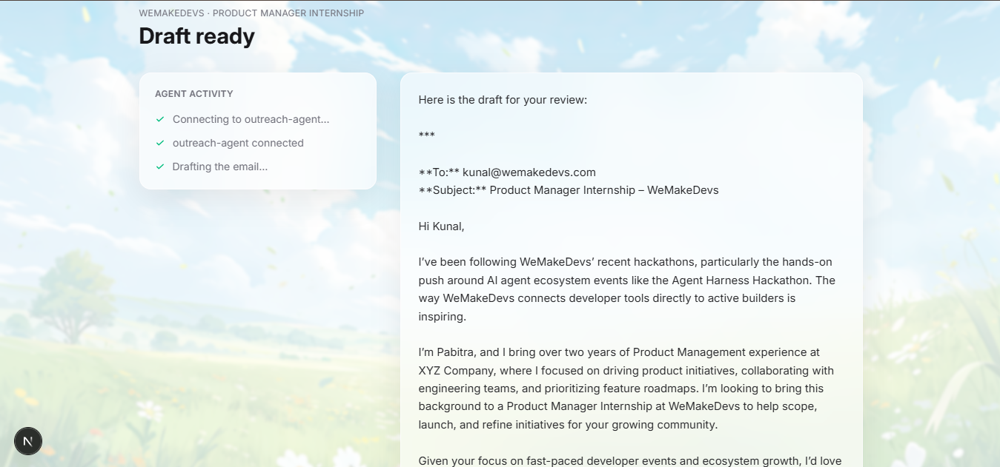
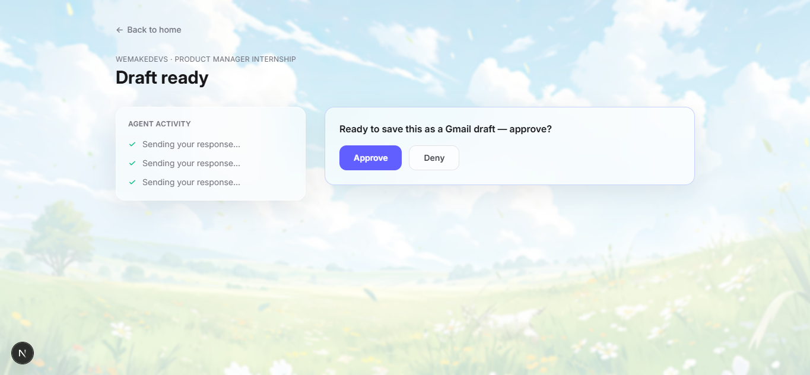
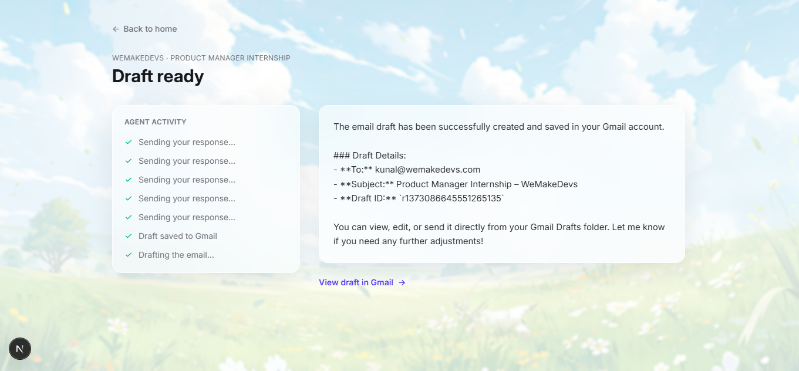
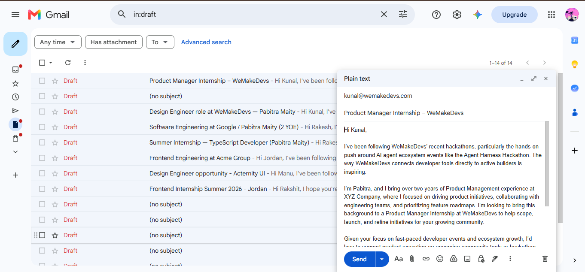

# Demo Walkthrough

A step-by-step walkthrough of Outreach, from the landing page to a real
draft landing in Gmail. Screenshots live in [`/assets`](./assets).

---

### 1. Landing page

The entry point — a quick overview of what the agent does before you commit
to filling anything in.

⬇️

### 2. New Outreach form

Company, role, recipient, and a short background — that's the whole input
the agent needs to get started.

⬇️

### 3. Agent researching live

The moment the agent starts working — a real, live web search via Exa, shown
step by step rather than a generic loading spinner.

⬇️

### 4. Instruct agent if anything have to update

If you want to update something in the mail then you can mention over here.

⬇️

### 5. Warning if anything has broken

Here is the warning if anything break in the background like AI tokens qouta limit or anything related to server.

⬇️

### 6. Draft generated

A personalized email, grounded in what the agent actually found — visible
in full before anything happens with it.

⬇️

### 7. Approval gate

The core safety moment. TrueForge pauses the turn here — nothing proceeds
until this is explicitly approved.

⬇️

### 8. Draft Details and Check in

This is the draft email details page and a check in button to see the actual draft in the actual gmail account.

⬇️

### 9. Real Gmail draft

The result: an actual draft, created in the real Gmail account, ready to
review and send.

---

[← Back to README](./README.md)