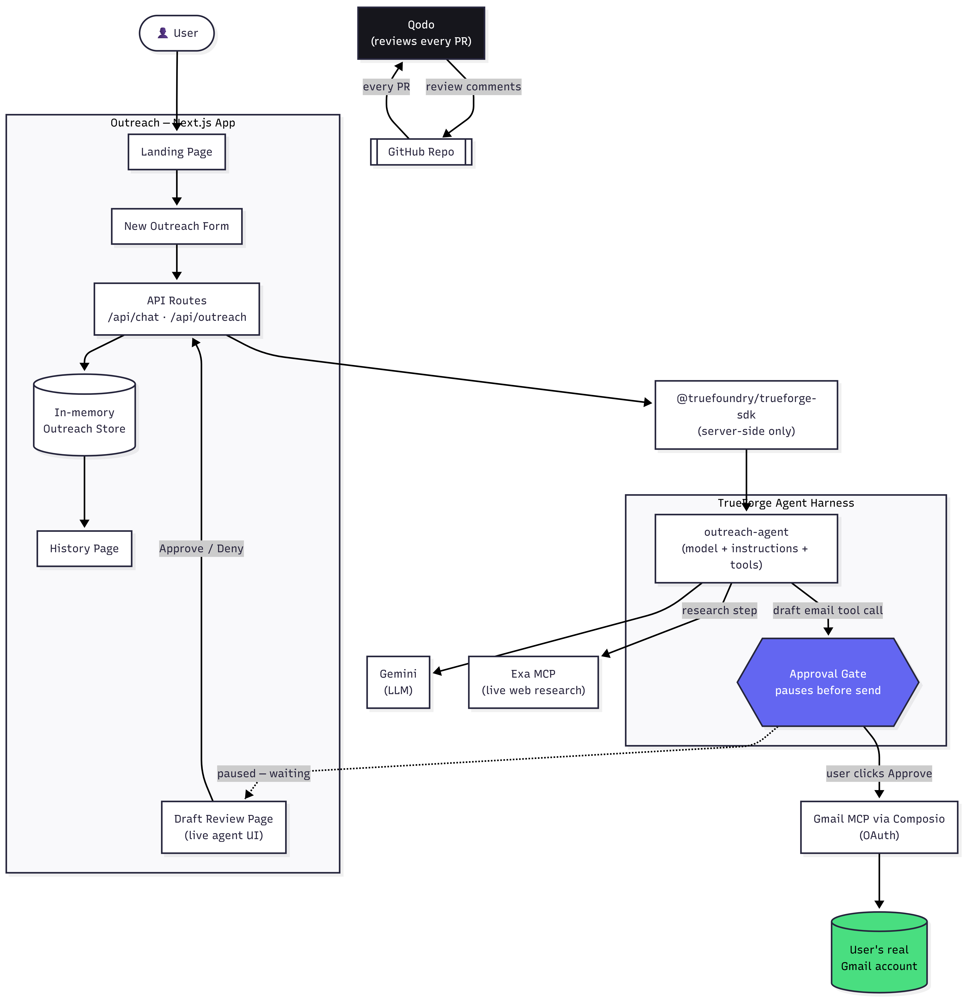

<div align="center">

# Outreach

**Cold outreach, researched and drafted for you — built on TrueForge.**

Tell it who you want to reach. It researches the company, drafts a real email,
and waits for your approval before anything sends.

[](https://nextjs.org)
[](https://www.typescriptlang.org)
[](https://trueforge.dev)
[](https://tailwindcss.com)
[](./LICENSE)
[](./CONTRIBUTING.md)

[Live Demo](https://www.youtube.com/watch?v=mPoYDK-e68o) · [Watch the Video](https://www.youtube.com/watch?v=mPoYDK-e68o) · [Report a Bug](https://github.com/Codewithpabitra/Outreach/issues)

</div>

---

## Table of Contents

- [The Problem](#the-problem)
- [What It Does](#what-it-does)
- [Demo](#demo)
  - [Full Screenshot Walkthrough](./DEMO.md)
- [How TrueForge Is Used](#how-trueforge-is-used)
- [Architecture](#architecture)
- [Tech Stack](#tech-stack)
- [Features](#features)
- [Getting Started](#getting-started)
- [Environment Variables](#environment-variables)
- [Project Structure](#project-structure)
- [Qodo Code Review Evidence](#qodo-code-review-evidence)
- [Roadmap](#roadmap)
- [Contributing](#contributing)
- [License](#license)
- [Contact](#contact)

---

## The Problem

Cold outreach for jobs and internships is repetitive and easy to get wrong:
generic emails that could have been sent to anyone, no real research behind
them, and no safety net before something irreversible — an email — goes out.

**Outreach** turns that into a small, controlled workflow: give it a company,
a role, and a recipient, and it does the research and the drafting for you —
live, in front of you — and never sends anything without your explicit
approval.

## What It Does

1. You fill in who you want to reach and a bit about yourself.
2. An AI agent researches the company using a real, live web search — not
   guesses from training data.
3. It drafts a personalized, specific email based on what it found.
4. Before anything happens in your real Gmail account, it **pauses and asks
   for your approval.**
5. Once approved, it creates a real draft in your Gmail account, ready to
   review and send.

Every step above is visible while it happens — not a spinner, an actual
live trace of what the agent is doing.

## Demo

<!-- Replace with your YouTube video embed once uploaded -->
Youtube Demo →

[](https://youtu.be/mPoYDK-e68o)

*(Click the thumbnail above to watch the full walkthrough.)*

OR

[**→ View the full step-by-step screenshot walkthrough**](./DEMO.md)

## How TrueForge Is Used

[TrueForge](https://trueforge.dev) is the open-source agent harness this
entire project runs on. It is not a thin wrapper — it is the actual runtime
doing the work:

- **Model orchestration** — the agent runs on Gemini, configured and swapped
  through TrueForge's model catalog, with no custom LLM-calling code in this
  repo at all.
- **Tool use via MCP** — the agent reaches two real Model Context Protocol
  servers: **Exa** for live web research, and a **Gmail connector (via
  Composio)** for creating real email drafts in the user's account.
- **The approval gate** — the "save as Gmail draft" tool call is configured
  as *approval-required* directly in TrueForge's agent composer. When the
  agent tries to call it, the turn **pauses** and TrueForge emits a
  `tool.approval_required` event — the app renders that as the Approve/Deny
  card, and nothing proceeds until the person responds.
- **Custom UI on the TypeScript SDK** — rather than the bundled TrueForge
  chat UI, this app is built directly on `@truefoundry/trueforge-sdk`,
  streaming raw turn events (research, drafting, tool calls, the approval
  pause) into a fully custom Next.js interface.

## Architecture


**Request flow, in short:**

```
Browser (Next.js app, custom UI)
        │
        ▼
Next.js API routes  ──────────────►  In-memory outreach store
        │  (server-side)
        ▼
@truefoundry/trueforge-sdk
        │
        ▼
TrueForge server (local harness)
        │
        ├──► Gemini (model)
        ├──► Exa MCP (live web research)
        └──► Gmail MCP via Composio (drafts — gated by approval)
```

The browser never talks to TrueForge directly — every call goes through a
Next.js route handler, which streams TrueForge's Server-Sent Events back out
to the client. This keeps API keys and the harness itself server-side only.

## Tech Stack

- **Frontend:** Next.js (App Router), TypeScript, Tailwind CSS, Framer Motion
- **Agent runtime:** [TrueForge](https://trueforge.dev) (`@truefoundry/trueforge-sdk`)
- **Model:** Gemini
- **Tools (MCP):** Exa (web research), Gmail via Composio (email drafts)
- **Code review:** [Qodo](https://qodo.ai)

## Features

- 🔍 **Real research, not invention** — every draft is grounded in a live
  web search, not the model guessing from its training data.
- ✍️ **Personalized drafts** — specific, concise emails referencing real,
  current details about the company.
- ✅ **Human approval gate** — nothing is sent or saved without explicit
  confirmation, every single time.
- 📬 **Real Gmail integration** — creates an actual draft in the user's
  inbox, not a mockup or a copy-paste block.
- 📡 **Live activity feed** — every research step, tool call, and pause is
  shown in plain language as it happens.
- 🎨 **Fully custom UI** — built directly on the TrueForge TypeScript SDK,
  no off-the-shelf chat widget.

## Getting Started

### Prerequisites

- Node.js **22+**
- A running [TrueForge](https://trueforge.dev) server (local or hosted)
- A Gemini API key
- An Exa MCP connection and a Gmail MCP connection (via Composio) configured
  on your TrueForge agent

### Installation

```bash
git clone https://github.com/Codewithpabitra/Outreach.git
cd Outreach
npm install
```

### Run TrueForge locally

```bash
npx @truefoundry/trueforge@latest
```

This starts the harness at `http://localhost:8790`. Configure your model
provider and MCP connectors (Exa, Gmail via Composio) there before continuing.

### Run the app

```bash
npm run dev
```

Open [http://localhost:3000](http://localhost:3000).

## Environment Variables

| Variable | Description | Default |
| --- | --- | --- |
| `TRUEFORGE_BASE_URL` | URL of your running TrueForge server | `http://localhost:8790` |

## Project Structure

```
app/
  page.tsx                    # Landing page
  new/page.tsx                # New Outreach form
  outreach/[id]/page.tsx      # Draft Review — agent runs here
  history/page.tsx            # Past outreach records
  api/
    chat/route.ts             # Proxies turns to the TrueForge SDK, streams SSE
    outreach/route.ts         # Create / list outreach records
    outreach/[id]/route.ts    # Get / update a single record
lib/
  store.ts                    # In-memory outreach record store
```

## Qodo Code Review Evidence

Every substantive pull request in this repository is reviewed by
[Qodo](https://qodo.ai) before merge.

- Representative reviewed PR: **[link to your merged PR here]**
- Example finding: Qodo flagged that the newly added TrueForge packages
  required Node 22+, but `package.json` did not declare that engine
  constraint. Fixed by adding an `engines` field and re-running the review.

See the repository's [Pull Requests](https://github.com/Codewithpabitra/Outreach/pulls?q=is%3Apr) tab for the full review history.

## Roadmap

- [ ] Resume attachment support on drafted emails
- [ ] Persistent storage (replace the in-memory store for production use)
- [ ] Deploy the TrueForge harness alongside the app for a public demo

## Contributing

Contributions are welcome — see [CONTRIBUTING.md](./CONTRIBUTING.md) for
branch naming, commit conventions, and the PR/review process this project
follows.

## License

Distributed under the MIT License. See [LICENSE](./LICENSE) for details.

## Contact

**Pabitra Maity**

[](https://github.com/Codewithpabitra)
[](https://www.linkedin.com/in/pabitra-maity-72ba04323)
[](https://x.com/CodeX_Pabitra)

Project link: [github.com/Codewithpabitra/Outreach](https://github.com/Codewithpabitra/Outreach)